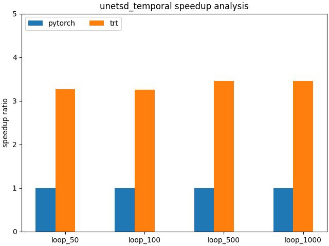

# 

## 修改记录

1. 注释掉`run_net.py`中的`import numpy as np`
2. 注释掉`run_test.py`中的`import numpy as np`
3. 修改：`tools/videocomposer/unet_sd.py`
    * 将`attn_cls = MemoryEfficientCrossAttention`修改为`attn_cls = CrossAttention`
4. 下载`model-weights`,安装`readme.md`操作
    * 这里我已经有下载好的文件
        * `mv model_weights model_weights-bk`
        * `ln -s /workspace/code/aigc/text2video/videocomposer/model_weights model_weights`

<br>

## TRT Engine生成
1. onnx model export
    * 修改`run_test.py`中的`from tools.videocomposer.test_unet_temporal1 import *`
    * 运行：`CUDA_VISIBLE_DEVICES=0 python run_test.py    --cfg configs/exp02_motion_transfer.yaml    --seed 9999    --input_video "demo_video/motion_transfer.mp4"    --image_path "demo_video/moon_on_water.jpg"    --input_text_desc "A beautiful big moon on the water at night"`
    * 
        ```
        ======= Diagnostic Run torch.onnx.export version 2.1.0.dev20230704+cu118 =======
        verbose: False, log level: 40
        ======================= 0 NONE 0 NOTE 0 WARNING 0 ERROR ========================
        ```
2. trt engine save
    * 切换到命令行，运行：`trtexec --onnx=./onnx/unetsd_temporal.onnx --saveEngine=./engine/unetsd_temporal.engine --fp16`
        * 注意: 保证`onnx`, `engine`目录存在，且有效


##  profile
1. 运行程序
    * 修改`run_test.py`中的`from tools.videocomposer.test_unet_temporal_profile import *`
    * 运行：`CUDA_VISIBLE_DEVICES=0 python run_test.py    --cfg configs/exp02_motion_transfer.yaml    --seed 9999    --input_video "demo_video/motion_transfer.mp4"    --image_path "demo_video/moon_on_water.jpg"    --input_text_desc "A beautiful big moon on the water at night"`
2. 说明：
    * 测试对比的是`pytorch fp32`和`trt fp16`
        * 为何如此对比？
            * 在`pytorch nightly`版本下，输入都为`fp32`，采用`pytorch 16bit`，会报错，这个错误在`pytorch 2.0`或以前的正式版本就不会出现；
            * 如果不采用`pytorch nightly`版本, `trt engine`无法正常转换；
            * 如果导出`onnx model`的时候采用`fp16`，`onnx`模型无法正常导出。采用`cpu`导出时，`unetsd_temporal`不支持，采用`gpu`导出的时候，会报`device`不一致的错误
        * 如果要对比`pytorch fp16`和`trt fp16`，可以在`pytorch 1.13`版本中，进行`pytorch 16bit`的测时操作；
3. 分析结果如下：
    ```
    time elapsed: 1.858 s
    when loop 50:   pytorch time elapsed: 10.744 s
    when loop 50:   trt time elapsed: 3.287 s
    when loop 50:   pytorch_time / trt_time is 3.268
    when loop 100:  pytorch time elapsed: 22.309 s
    when loop 100:  trt time elapsed: 6.850 s
    when loop 100:  pytorch_time / trt_time is 3.257
    when loop 500:  pytorch time elapsed: 121.457 s
    when loop 500:  trt time elapsed: 35.180 s
    when loop 500:  pytorch_time / trt_time is 3.452
    when loop 1000: pytorch time elapsed: 243.032 s
    when loop 1000: trt time elapsed: 70.444 s
    when loop 1000: pytorch_time / trt_time is 3.450
    ```
    